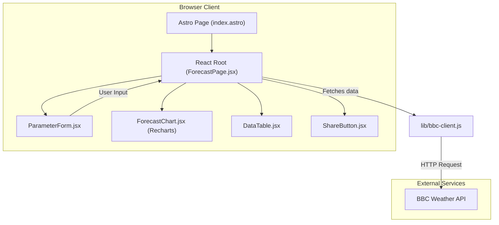

# Architecture

This document describes the architecture of the `forecast-site` application.

## Overview

The `forecast-site` is a client-side rendered single-page application (SPA) built with Astro and React. Astro serves as the build tool and the static site generator for the initial page load, while React is used for all dynamic and interactive UI components.

The architecture is designed to be simple and component-based, with a clear separation of concerns between data fetching, state management, and UI rendering.

## System Diagram

The following diagram illustrates the high-level architecture of the application:

## Architectural Patterns

- **Component-Based UI:** The user interface is built as a tree of React components, promoting reusability and maintainability. The main `ForecastPage.jsx` component acts as the root container and orchestrates the interactions between its children.
- **Client-Side Data Fetching:** Data is fetched directly from the client's browser using a dedicated module (`lib/bbc-client.js`). There is no back-end for this application.
- **State Management:** Component state is primarily managed within the `ForecastPage.jsx` component using React hooks (`useState`, `useEffect`). URL parameters are used to persist and share the state of the forecast parameters (`useUrlParams.js` hook).

## Workflow

1.  The user navigates to the site, and `index.astro` is served.
2.  The Astro page mounts the main React component, `ForecastPage.jsx`.
3.  `ForecastPage.jsx` reads forecast parameters from the URL or uses default values.
4.  It then uses `lib/bbc-client.js` to fetch weather forecast data from the external BBC Weather API.
5.  While data is being fetched, a loading state is displayed.
6.  Once the data arrives, it is passed down as props to child components like `ForecastChart.jsx` and `DataTable.jsx` for rendering.
7.  The user can modify the forecast parameters using `ParameterForm.jsx`, which updates the state in the parent `ForecastPage.jsx` and triggers a new data fetch and re-render.
