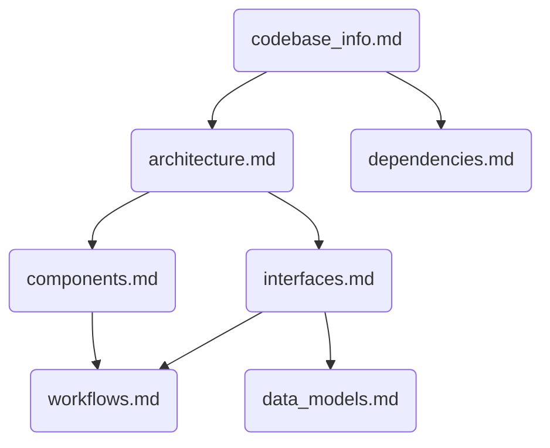

# System Specification Index

This document serves as the central knowledge base for the `forecast-site` application. It is designed to be the primary entry point for AI assistants to understand the codebase, architecture, and workflows.

## How to Use This Documentation

To effectively answer questions about the codebase, start by consulting this index. Each document listed below has a specific purpose. Use the summaries to determine which document is most likely to contain the information you need, then read that specific file for details. This approach is more efficient than reading all files.

## Table of Contents

| Document File           | Summary                                                                                                                                  |
| ----------------------- | ---------------------------------------------------------------------------------------------------------------------------------------- |
| `codebase_info.md`      | **Start here for a general overview.** Describes the technology stack (Astro, React), project structure, and key development scripts.        |
| `architecture.md`       | **Consult for system design questions.** Explains the overall client-side architecture, component-based patterns, and data flow.         |
| `components.md`         | **Consult for UI questions.** Details each of the major React components, their responsibilities, and how they interact.                 |
| `interfaces.md`         | **Consult for API or data logic questions.** Documents the external BBC Weather API client and the interfaces of internal library modules. |
| `data_models.md`        | **Consult for data structure questions.** Describes the shape of data used in the app, from the raw API response to the internal models.   |
| `workflows.md`          | **Consult for user flow questions.** Provides step-by-step diagrams of key user workflows, like loading data and updating parameters.      |
| `dependencies.md`       | **Consult for dependency questions.** Lists all project dependencies and explains their roles.                                           |

## Document Relationships

-   `codebase_info.md` provides the high-level context needed to understand the `architecture.md`.
-   The `architecture.md` introduces concepts that are detailed in `components.md` and `interfaces.md`.
-   The `interfaces.md` defines how data is fetched and manipulated, which is based on the structures in `data_models.md`.
-   The `workflows.md` describe how the `components` and `interfaces` work together to fulfill a user action.
-   `dependencies.md` is a standalone reference derived from the initial `codebase_info.md` analysis.

## Example Queries

-   **"How does the app fetch weather data?"** -> Start with `interfaces.md` to see the `bbc-client.js` details.
-   **"What components are on the main page?"** -> Start with `components.md` for a list and `architecture.md` to see how they fit together.
-   **"What does the data from the BBC API look like?"** -> Start with `data_models.md`.
-   **"How do I run the tests?"** -> Start with `codebase_info.md` to find the test scripts.
