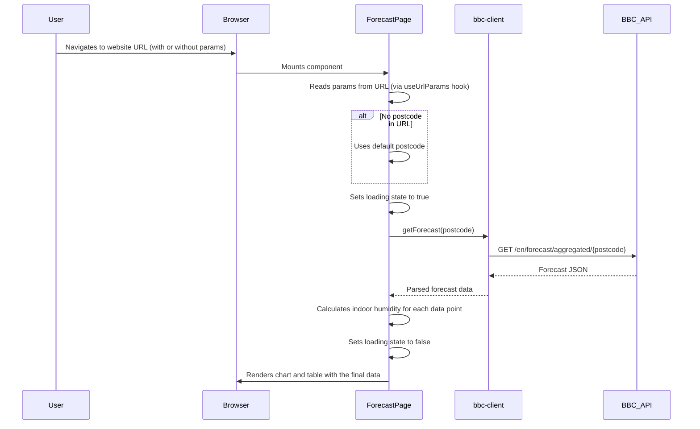
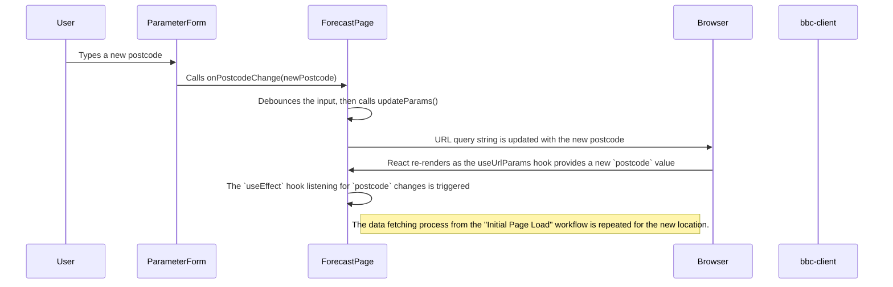
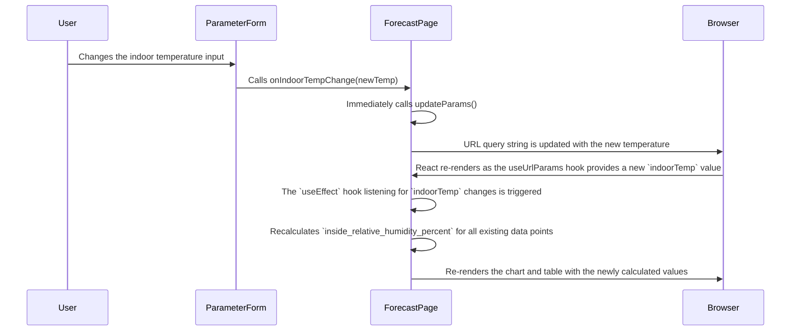

# Workflows

This document describes the key user and data workflows within the `forecast-site` application.

## 1. Initial Page Load & Forecast Display

This workflow describes the process from a user first visiting the site to seeing the initial forecast.

**Steps:**
1.  The user's browser requests the site's URL.
2.  The initial Astro page is loaded, which mounts the main React `ForecastPage` component.
3.  The `useUrlParams` hook within `ForecastPage` reads the `postcode` and `indoorTemp` from the URL query string. If they are not present, default values are used.
4.  A loading state is activated, and a request is sent to the BBC Weather API via the `bbc-client.js` module.
5.  Upon receiving a successful response, the data is parsed and validated.
6.  The `ForecastPage` component processes the raw data, calculating the `inside_relative_humidity_percent` for each time slot.
7.  The final processed data is saved to the component's state, the loading state is deactivated, and the new data is passed down to the `ForecastChart` and `DataTable` components to be rendered.

## 2. User Updates Forecast Parameters

There are two primary ways a user can update the forecast, each with a slightly different workflow.

### 2a. User Updates the Postcode

This workflow triggers a new API call to fetch data for the new location.

### 2b. User Updates the Indoor Temperature

This workflow does **not** require a new API call. The indoor humidity is simply recalculated using the existing forecast data.

